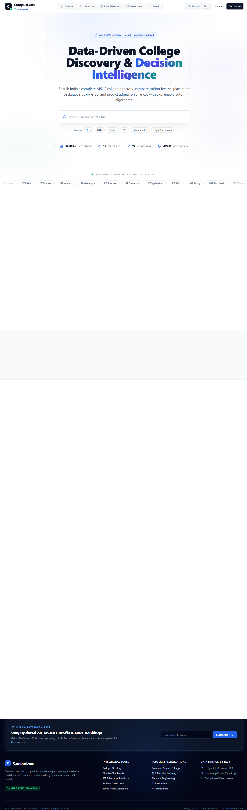
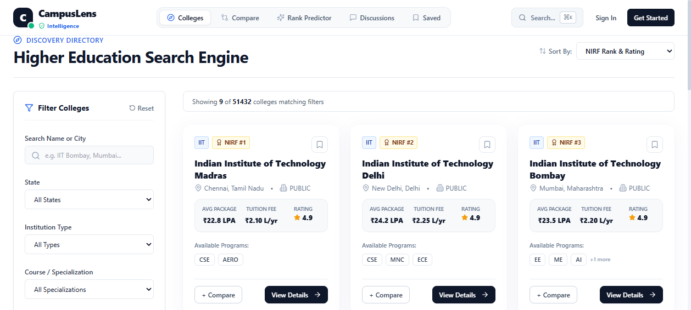
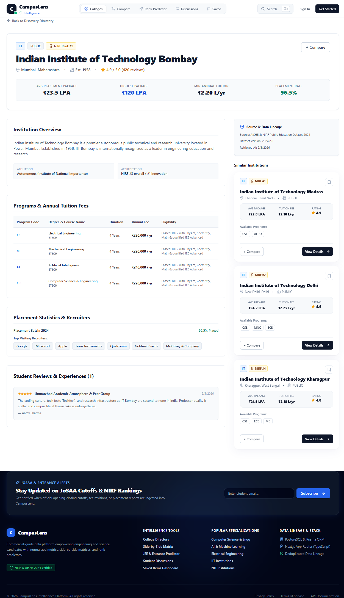
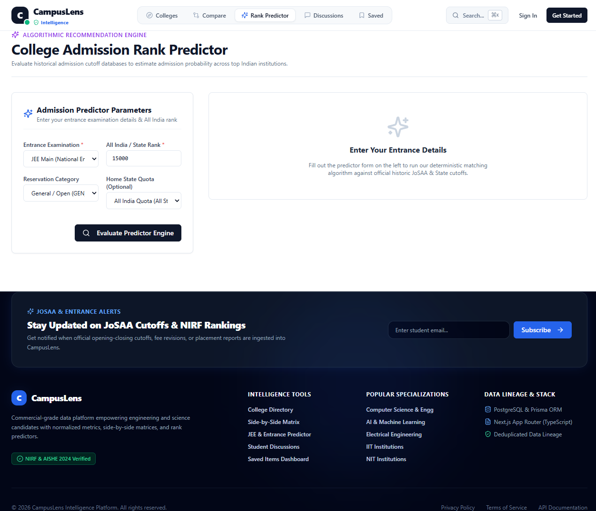
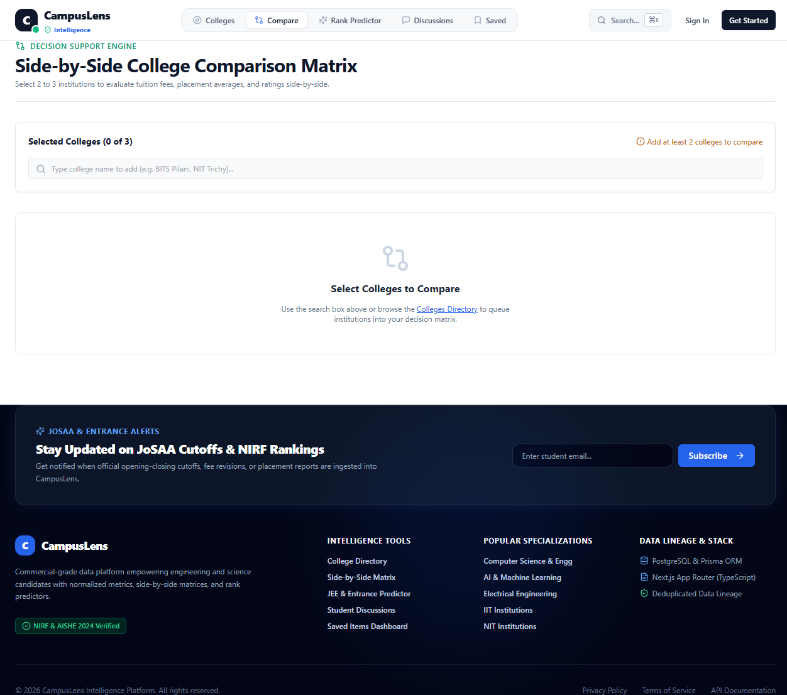

# CampusLens — College Discovery & Decision Intelligence Platform

**Live:** [https://college-intelligence.vercel.app](https://college-intelligence.vercel.app)

CampusLens is a production-grade, data-driven platform for college discovery, side-by-side comparison, admission prediction, and decision intelligence — built for higher-education candidates in India and powered by the **complete official AISHE directory of 52,000+ institutions**.

Built with **Next.js 15 (App Router) · React 19 · TypeScript · TailwindCSS · PostgreSQL (Neon) · Prisma ORM**

---

## Dashboard Preview

| Home — Fuzzy Live Search | College Directory |
|:---:|:---:|
|  |  |

| College Profile | Rank Predictor |
|:---:|:---:|
|  |  |

| Comparison Workspace |
|:---:|
|  |

---

## 🏛️ System Architecture

```
                                 ┌──────────────────────────────────────────────┐
                                 │              Next.js Frontend                │
                                 │  (App Router, React 19, Tailwind CSS UI)     │
                                 └──────────────────────┬───────────────────────┘
                                                        │ HTTP / JSON REST
                                 ┌──────────────────────▼───────────────────────┐
                                 │            API Layer (App Router)            │
                                 │     (Controllers, Zod Input Validation)      │
                                 └──────────────────────┬───────────────────────┘
                                                        │ Domain Calls
                                 ┌──────────────────────▼───────────────────────┐
                                 │             Service / Business Layer         │
                                 │  (CollegeService, PredictorService, Fuzzy)   │
                                 └──────────────────────┬───────────────────────┘
                                                        │ Queries
                                 ┌──────────────────────▼───────────────────────┐
                                 │           Data Access Layer (Prisma)         │
                                 └──────────────────────┬───────────────────────┘
                                                        │ SQL
                                  ┌────────────────────▼───────────────────────┐
                                  │          PostgreSQL (Neon Serverless)       │
                                  │        (51,000+ Institutions Indexed)       │
                                  └────────────────────────────────────────────┘
```

---

## 🌟 Core Product Features

### 1. College Discovery & Fuzzy Search (`/colleges`)
* **52,000+ Institutions**: The full AISHE national directory — every affiliated and constituent college across 36 states/UTs.
* **Typo-Tolerant Search**: Two-tier fuzzy engine — misspell "IIT Bombay" as "iit bombey" and still find it. Works in the hero autocomplete and the directory.
* **Database-Driven Filtering**: State, Institution Type (IIT, NIT, IIIT, Central/State/Private University, Affiliated & Constituent Colleges), Ownership, Max Fee, Min Rating, Min Placement (LPA), and Specialization.
* **URL Parameter Sync**: Filter states sync to the URL (`/colleges?state=Maharashtra&course=CSE&sort=placement`) for shareable links.
* **Server-Side Pagination** with relevance-ranked search results.

### 2. Side-by-Side Comparison Workspace (`/compare`)
* Compare 2–3 colleges in a decision matrix with **automated highlights**: lowest tuition (*Best Value*), highest average package (*Top Package*), top rating, best NIRF rank.
* Logged-in users can save comparison configurations.

### 3. Entrance Rank Predictor (`/predictor`)
* Input exam (JEE Main/Advanced, NEET, GATE, MHT-CET, WBJEE), rank, category, and state quota.
* **Explainable tiered matches**: Strong (within 90% of closing rank), Possible (90–115%), Reach (115–145%) — each with the historical cutoff bounds that produced the verdict.

### 4. Discussion & Q&A Forum (`/discussions`)
* Community board for admissions, campus life, and branch questions with admin/educator verified badges.

### 5. Accounts & Saved Items (`/login`, `/signup`, `/saved`)
* Cookie-based JWT sessions, bcrypt password hashing, saved colleges and comparisons.

---

## 🔄 Data Ingestion & Quality Pipeline

### 1. AISHE National Directory Import (`scripts/import-aishe.ts`)
Imports the **complete official AISHE directory** (52,000+ institutions) from the two Excel exports:
* Enriches curated NIRF-ranked profiles instead of duplicating them
* Auto-generates descriptions, slugs, and ownership mappings
* Batched `createMany` with retry + resume (safe to re-run after any interruption)
```bash
npm run data:aishe   # requires the two .xlsx files in scripts/data/
```

### 2. Curated Enrichment Pipeline (`scripts/import-data.ts`)
Imports 40 premier institutions with fees, placements, cutoffs, and recruiter data:
```
 Raw Payload (JSON) ──► Parser ──► Validator ──► Normalizer ──► Deduplicator ──► Prisma Upserts
```

### 🔎 Fuzzy Search Engine (`src/lib/fuzzy-search.ts`)
* **Tier 1 — SQL candidates**: token `contains` + two-character-prefix matching (the prefix rule is what makes typo tolerance possible: "bombey" → "bo" → "Bombay")
* **Tier 2 — Fuse.js ranking**: approximate-string scoring orders results by relevance

---

## 🗄️ Database Schema (Prisma)

`User` · `DataSource` · `College` (with AISHE fields: `aisheCode`, `district`, `website`, `management`, `universityName`) · `Course` · `CollegeCourse` · `PlacementRecord` · `ExamCutoff` · `Review` · `Discussion` · `Answer` · `SavedCollege` · `SavedComparison`

---

## 📡 API Endpoints

| Method | Endpoint | Description |
| :--- | :--- | :--- |
| `GET` | `/api/colleges` | Fuzzy search, filter, and paginate colleges |
| `GET` | `/api/colleges/suggest?q=` | Typo-tolerant autocomplete suggestions |
| `GET` | `/api/colleges/:slug` | Detailed college profile + similar colleges |
| `POST` | `/api/colleges/:slug/reviews` | Submit student review (auth required) |
| `POST` | `/api/comparisons` | Compute comparison matrix for 2–3 colleges |
| `POST` | `/api/predictor` | Run rank prediction algorithm |
| `POST` | `/api/auth/register` | Create account (rate limited: 5/hour/IP) |
| `POST` | `/api/auth/login` | Authenticate & issue JWT cookie (10/15min/IP) |
| `POST` | `/api/auth/logout` | Clear session |
| `GET` | `/api/auth/me` | Current user profile |
| `GET/POST` | `/api/me/saved-colleges` | List/save bookmarks (auth required) |
| `DELETE` | `/api/me/saved-colleges/:id` | Remove bookmark (ownership enforced) |
| `GET/POST` | `/api/me/saved-comparisons` | List/save comparisons (auth required) |
| `GET/POST` | `/api/discussions` | List/post forum threads |
| `GET` | `/api/discussions/:id` | Single thread with answers |
| `POST` | `/api/discussions/:id/answers` | Post answer (auth required) |

---

## 🛠️ Local Setup

### Prerequisites
* Node.js v18+ · npm
* PostgreSQL 14+ — a free [Neon](https://neon.tech) cloud DB (recommended, matches production) or local Docker

```bash
git clone https://github.com/Zacker/College_Discovery_Intelligence.git
cd College_Discovery_Intelligence
npm install

cp .env.example .env
# Set DATABASE_URL and generate AUTH_SECRET:
node -e "console.log(require('crypto').randomBytes(32).toString('base64'))"

npx prisma db push     # create schema
npm run db:seed        # curated colleges, cutoffs, demo users
npm run data:aishe     # optional: import the full 52k AISHE directory

npm run dev            # http://localhost:3000
```

---

## 🧪 Testing & CI

```bash
npm run test    # Vitest suite (Predictor, Comparison, Search)
npm run lint    # ESLint (0 errors, 0 warnings)
```

GitHub Actions (`.github/workflows/ci.yml`) runs schema push → seed → tests → lint → build against an ephemeral Postgres service on every push and PR.

---

## 🔐 Security Hardening

* **Authentication**: JWT (HS256) in HTTP-only, SameSite=Lax cookies; bcrypt password hashing; 8+ char passwords with letter+number policy; defensive JWT payload shape verification.
* **No fallback secrets**: the app refuses to boot without a 32+ character `AUTH_SECRET`.
* **Rate limiting everywhere it matters**: login/register/demo-login per-IP; reviews, discussions, answers, and saves per-user — all sliding-window.
* **Zod validation on every input**: strict UUID, length, and enum constraints on all API routes (including query params — no NaN/unbounded pagination).
* **Security headers**: CSP, HSTS, X-Frame-Options DENY, nosniff, Referrer-Policy, Permissions-Policy via `next.config.ts`.
* **PII protection**: user emails never exposed in reviews or discussion responses.
* **XSS-safe rendering**: all user content rendered through React's escaping — zero `dangerouslySetInnerHTML` in the codebase.
* **Demo credentials server-gated**: only active when `ENABLE_DEMO_ACCOUNTS=true`; never shipped to the client bundle.

---

## 🚀 Deployment

Production runs on **Vercel + Neon Postgres** at [college-intelligence.vercel.app](https://college-intelligence.vercel.app).

See **[DEPLOYMENT.md](./DEPLOYMENT.md)** for the complete guide: environment variables, database provisioning, seeding, the AISHE import, and the post-deploy verification checklist.

---

## 📄 License

MIT
